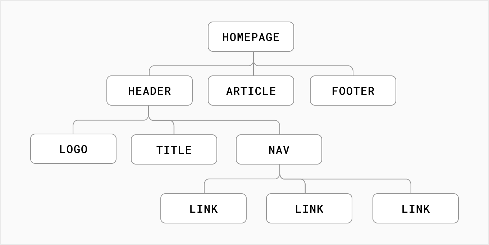

# Building UI with Components

User interfaces can be broken down into smaller building blocks called `components`.

Components allow you to build self-contained, reusable snippets of code. If you think of components as `LEGO bricks`, you can take these individual bricks and combine them together to form larger structures. If you need to update a piece of the UI, you can update the specific component or brick.

This modularity allows your code to be more maintainable as it grows because you can easily add, update, and delete components without touching the rest of our application.

The nice thing about React components is that they are just JavaScript. Let's see how you can write a React component, from a JavaScript perspective:

## Creating components

In React, components are `functions`. Inside your `script` tag, write a function called `header`:

```jsx
<script type="text/jsx">
  const app = document.getElementById("app")


  function header() {
  }

  ReactDOM.render(<h1>Develop. Preview. Ship. 🚀</h1>, app)
</script>
```

A component is a function that `returns UI elements`. Inside the return statement of the function, you can write JSX:

```jsx
<script type="text/jsx">
  const app = document.getElementById("app")

  function header() {
     return (<h1>Develop. Preview. Ship. 🚀</h1>)
   }

  ReactDOM.render(, app)
</script>
```

To render this component to the DOM, you can pass it as the first argument in the `ReactDOM.render()` method:

```jsx
<script type="text/jsx">

  const app = document.getElementById("app")

  function header() {
     return (<h1>Develop. Preview. Ship. 🚀</h1>)
   }


   ReactDOM.render(header, app)
</script>
```

But, wait a second. If you try to run the code above in your browser, you’ll get an error. To get this to work, there are two things you have to do:

First, React components should be capitalized to distinguish them from plain HTML and JavaScript.

```js
function Header() {
  return <h1>Develop. Preview. Ship. 🚀</h1>
}

// Capitalize the React Component
ReactDOM.render(Header, app)
```

Second, you use React components the same way you’d use regular HTML tags, with angle brackets `<>`.

```js
function Header() {
  return <h1>Develop. Preview. Ship. 🚀</h1>
}

ReactDOM.render(<Header />, app)
```

## Nesting Components

Applications usually include more content than a single component. You can `nest` React components inside each other like you would regular HTML elements.

In your example, create a new component called `HomePage`:

```js
function Header() {
  return <h1>Develop. Preview. Ship. 🚀</h1>
}
function HomePage() {
  return <div></div>
}

ReactDOM.render(<Header />, app)
```

Then nest the `<Header>` component inside the new `<HomePage>` component:

```js
function Header() {
  return <h1>Develop. Preview. Ship. 🚀</h1>
}

function HomePage() {
  return (
    <div>
      {/* Nesting the Header component */}
      <Header />
    </div>
  )
}

ReactDOM.render(<Header />, app)
```

## Component Trees

You can keep nesting React components this way to form component trees.



For example, your top-level `HomePage` component could hold a `Header`, an `Article`, and a `Footer` Component. And each of those components could in turn have their own child components and so on. For example, the `Header` component could contain a `Logo`, `Title` and `Navigation` component.

This modular format allows you to reuse components in different places inside your app.

In your project, since `<HomePage>` is now your top-level component, you can pass it to the `ReactDOM.render()` method:

```js
function Header() {
  return <h1>Develop. Preview. Ship. 🚀</h1>
}

function HomePage() {
  return (
    <div>
      <Header />
    </div>
  )
}

ReactDOM.render(<HomePage />, app)
```

In the next section, we will discuss `props` and how you can use them to pass data between your components.

